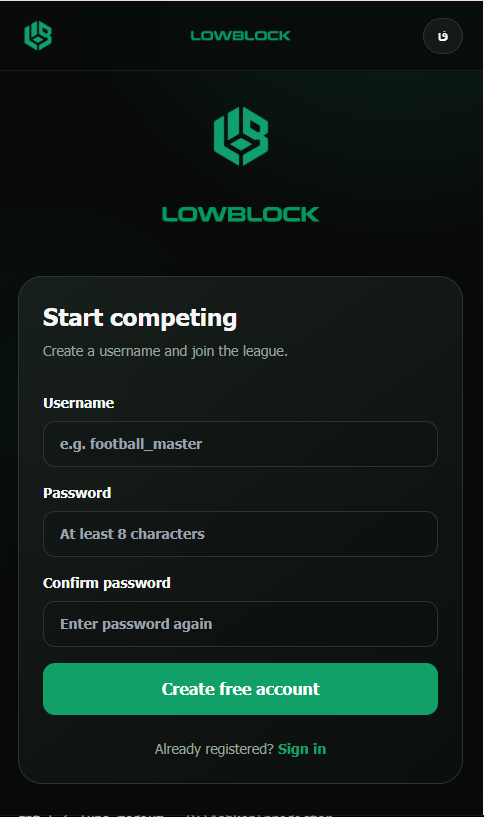
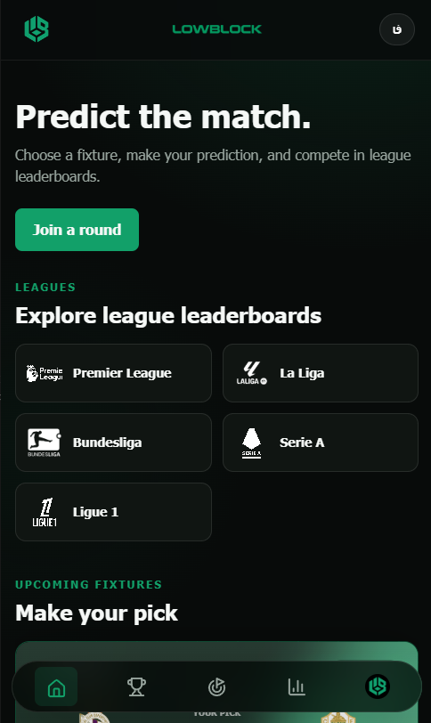
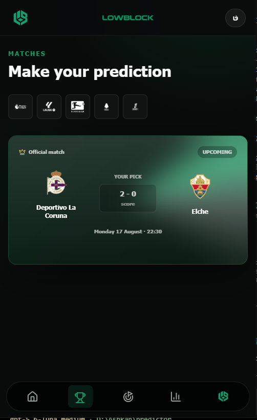
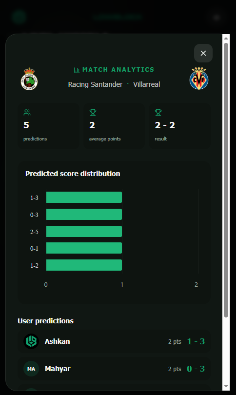
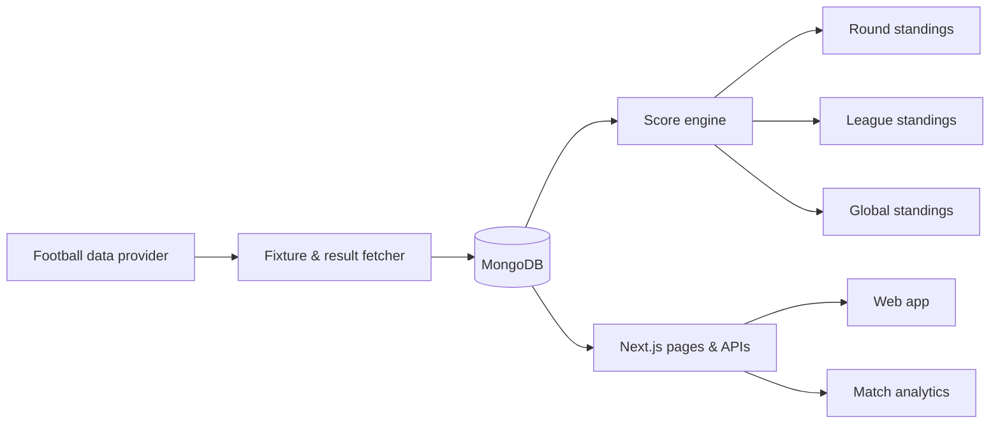

# LowBlock

### Football predictions, beautifully built for every matchday.

LowBlock is a bilingual (English / فارسی) football score-prediction platform for fans who want more than a fixture list. Pick exact scores before kick-off, follow live competition, study match analytics, and climb league and global leaderboards — without betting, payments, or monetary prizes.

> **Live product:** [lowblock.ir](https://lowblock.ir) · **Repository:** [github.com/AshkaanGiveki/LowBlock](https://github.com/AshkaanGiveki/LowBlock)

[](https://nextjs.org/)
[](https://react.dev/)
[](https://www.typescriptlang.org/)
[](https://www.mongodb.com/)
[](https://tailwindcss.com/)
[](#license)

<p align="center">
  
</p>

## See LowBlock in action

The interface is designed around a calm, focused matchday flow: join the competition, discover a league, lock in a prediction, and return after kick-off for transparent analytics.

<table>
  <tr>
    <td width="50%" valign="top">
      
      <br />
      <strong>01 · Start competing</strong><br />
      <sub>Create an account in seconds and enter the competition with a username and password.</sub>
    </td>
    <td width="50%" valign="top">
      
      <br />
      <strong>02 · Discover leagues</strong><br />
      <sub>Explore the major European leagues and move from the home feed into the competition that matters to you.</sub>
    </td>
  </tr>
  <tr>
    <td width="50%" valign="top">
      
      <br />
      <strong>03 · Make your pick</strong><br />
      <sub>Review the fixture, team crests, kick-off time, and your saved score prediction in one clear match card.</sub>
    </td>
    <td width="50%" valign="top">
      
      <br />
      <strong>04 · Read the match</strong><br />
      <sub>After kick-off, inspect prediction distribution, average points, the final result, and eligible player predictions.</sub>
    </td>
  </tr>
</table>

<p align="center"><sub>Mobile-first screens · bilingual-ready interface · analytics become available after the match starts</sub></p>

## What LowBlock feels like

| Before kick-off | During the round | After the whistle |
|---|---|---|
| Lock in a score prediction | Follow fixtures and round progress | Explore analytics and earned points |
| See team form and kick-off time | Compare your position with the league | Review every prediction and result |
| Compete in a fair, transparent system | Keep predictions private until the match starts | Build a season-long record |

## Product highlights

- **Prediction-first match experience** — upcoming predictable fixtures are clear, focused, and protected from accidental late edits.
- **Fair scoring engine** — exact score, winner/draw, goal difference, participation, and no-prediction rules are calculated consistently after results are fetched.
- **League competition** — league totals, season totals, round-by-round leaderboards, active-round indicators, and per-user prediction breakdowns.
- **Match intelligence** — post-kick-off prediction distribution, community score averages, result comparisons, and points analytics.
- **Bilingual by design** — English and Persian content, right-to-left layout support, Persian team names, Persian numerals, and IranSans typography for Persian contexts.
- **Responsive mobile UI** — animated cards, skeleton loading states, bottom navigation, swipe navigation, expandable round players, and accessible motion.
- **Data integrity** — server-side validation, duplicate-safe imports, match-start privacy, and MongoDB-backed source-of-truth records.

## How the system fits together



The scheduled sync fetches match lists and results first. Only after a successful fetch does the score engine recalculate affected rounds, leagues, seasons, and global totals. This keeps leaderboards reproducible and makes a retry safe.

## Scoring model

LowBlock’s default scoring rules are intentionally simple and transparent:

| Outcome | Points |
|---|---:|
| Exact score | 10 |
| Correct winner or draw | 5 |
| Correct goal difference | 7 |
| Valid participation | 2 |
| No prediction | 0 |

The scoring implementation is the authority; this table is a quick explanation for players. If the product rules change, update the engine and this table together.

## Technology

- **App:** Next.js App Router, React 19, TypeScript
- **UI:** Tailwind CSS, Motion, Lucide icons, Highcharts
- **Data:** MongoDB driver with indexed match, prediction, user, and leaderboard collections
- **Football data:** API-Football for fixtures/results, with respectful public-data handling for supplementary metadata
- **Operations:** Vercel-compatible build, cron-triggered synchronization, environment-based secrets

## Local development

### Requirements

- Node.js 20+
- pnpm 9+
- MongoDB (Atlas or local)
- API-Football credentials for importing fixtures and results

### Setup

```bash
pnpm install
Copy-Item .env.example .env.local   # PowerShell
# cp .env.example .env.local        # macOS/Linux
```

Set at least `MONGODB_URI`, `SESSION_SECRET`, `CRON_SECRET`, `NEXT_PUBLIC_APP_URL`, `FOOTBALL_API_KEY`, and `FOOTBALL_API_BASE_URL` in `.env.local`.

```bash
pnpm dev                 # http://localhost:3000
pnpm sync:season         # import or refresh a season
pnpm data:check          # inspect data health
pnpm lint                # TypeScript validation
pnpm test                # Vitest suite
pnpm build               # production build
```

Never commit `.env.local`, API tokens, MongoDB credentials, or session secrets.

## Environment reference

| Variable | Purpose |
|---|---|
| `MONGODB_URI` | MongoDB connection string |
| `MONGODB_DIRECT_HOSTS` | Optional direct host override for Atlas troubleshooting |
| `MONGODB_REPLICA_SET` | Optional replica-set name |
| `SESSION_SECRET` | Secret used to sign website sessions |
| `CRON_SECRET` | Secret protecting scheduled sync endpoints |
| `NEXT_PUBLIC_APP_URL` | Canonical public URL used by links and metadata |
| `APP_TIMEZONE` | Scheduling/display timezone; defaults to `Asia/Tehran` |
| `FOOTBALL_API_KEY` | API-Football key |
| `FOOTBALL_API_BASE_URL` | Football provider base URL |
| `FOOTBALL_API_SEASON` | Optional explicit season override |
| `FOOTBALL_API_DAILY_LIMIT` | Provider request budget |
| `FOOTBALL_API_DETAIL_BATCH_SIZE` | Detail-fetch batch size |

## Repository map

```text
app/                 Pages, route handlers, metadata, and API endpoints
components/          Shared navigation, cards, charts, skeletons, and language UI
lib/                 Database, auth, football providers, scoring, and utilities
scripts/             Season sync and data-quality commands
public/              LowBlock marks, league assets, and fonts
tests/               Authentication, scoring, and integration coverage
```

## Data and privacy principles

- A prediction is private until its match has started; only then can community analytics expose aggregated or eligible public information.
- Scores are computed from persisted match results, not from client-submitted values.
- No gambling, wagering, deposits, or monetary rewards are part of LowBlock.
- Provider limits and challenge responses are respected; the app does not bypass access controls.

## Contributing

1. Create a focused branch from `develop`.
2. Keep English and Persian copy, RTL behavior, and responsive states in sync.
3. Add or update tests for scoring, data imports, and privacy-sensitive behavior.
4. Run `pnpm lint`, `pnpm test`, and `pnpm build` before opening a pull request.
5. Describe migration, environment, or cron changes clearly in the PR.

## Roadmap

- Richer league and season history views
- More post-match analytics and comparison tools
- Notification integrations for upcoming fixtures and results
- Deeper provider health checks and import observability
- Expanded automated browser coverage for mobile navigation and RTL layouts

## Brand

**LowBlock** is the product name. Use the official wordmark and mark from `public/lowblock-typo.png` and `public/lowblock.png`. Avoid reintroducing the old “Predictor” name in user-facing copy, package metadata, documentation, or integrations.

## License

This repository is currently private and is not distributed under an open-source license. All rights reserved by the project owner.

---

**لوبلاک** یک پلتفرم دوزبانه پیش‌بینی نتایج فوتبال است؛ پیش‌بینی خود را قبل از شروع بازی ثبت کنید، امتیاز بگیرید و در جدول لیگ و جدول کلی رقابت کنید — بدون شرط‌بندی و جایزه مالی.
